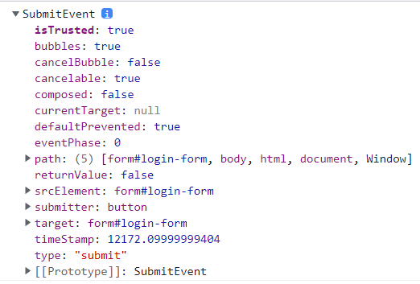

# 학습 정리
### 📔 innerText vs textContent
- 참고링크 목록
    1. [innerText와 textContent 차이 알아보기](https://webisfree.com/2020-03-07/[%EC%9E%90%EB%B0%94%EC%8A%A4%ED%81%AC%EB%A6%BD%ED%8A%B8]-textcontent-%EA%B7%B8%EB%A6%AC%EA%B3%A0-innertext-%EC%B0%A8%EC%9D%B4%EC%A0%90-%EC%95%8C%EC%95%84%EB%B3%B4%EA%B8%B0)
    2. [[Javascript] innerHTML, innerText, textContent 차이점](https://hianna.tistory.com/483)
   
- 요약
  - innerText 는 사용자에게 보여지는 그대로를 복사
  - textContent는 HTML 상에 입력되어진 그대로를 출력
    - 여러개의 공백을 그대로 표시하고 숨겨진 텍스트 또한 출력
  
### 📔 [CSS] nth-child
- `:nth-child` 만으로도 자식중에서 선택가능
  - 만약 `li:nth-child` 와 같은 식으로 쓴다면 조건을 만족하는 자식들중 `li` 인 요소면 출력하게 됨

### 📔 [JS] Array vs NodeList
- 참고링크 목록 
    1. [Difference between a NodeList and an Array in JavaScript](https://attacomsian.com/blog/javascript-nodelist-vs-array)

### 📔 namespace
- 참고링크 목록 
    1. [XML 네임스페이스](http://www.tcpschool.com/xml/xml_basic_namespace)

- 요약
XML문서에서 쓰는 태그의 사전
   -> XML 문서는 여러가지 종류가 있을 수 있고 각 데이터의 성격에 따라 같은 태그더라도 다른 의미로 쓰일 수 있기 때문에 한가지 종류에 대해 namespace를 마련해 놓은 것

### 📔 javascript Event
- 참고링크 목록 
    1. [JavaScript - 이벤트(Event), 이벤트의 종류, 이벤트 연결](https://jenny-daru.tistory.com/17)
    2. [onclick vs addEventListener](https://cbw1030.tistory.com/302)

### 📔 Event 버블링과 캡쳐링, 둘을 막는 방법
- 참고링크 목록 
    1. [JavaScript - 이벤트 버블링과 캡처링, 둘의 방지법](https://cbw1030.tistory.com/301?category=1142019)
    2. [버블링과 캡처링](https://ko.javascript.info/bubbling-and-capturing)

### 📔 개발자 도구의 No throttling
- 참고링크 목록 
    1. [개발자 도구 > Network > 'No throttling'의 의미?](https://unit-15.tistory.com/85)

### 📔 ClassList toggle multiple Class
- 참고링크 목록 
    1. [Vanilla JavaScript: Is there a way to toggle multiple CSS-classes in one statement?](https://stackoverflow.com/questions/36544762/vanilla-javascript-is-there-a-way-to-toggle-multiple-css-classes-in-one-stateme)

- 요약
  - 여러 방법이 있지만 `map()` 을 쓰자!

### 📔 `<form>`
- 참고링크 목록 
    1. [HTML form 의 이해](https://www.nextree.co.kr/p8428/)

### 📔 Event 객체
- 참고링크 목록 
    1. [Event Object(이벤트 객체)](https://cheonmro.github.io/2018/09/04/event-object/)
- submitEventObject 예시 
