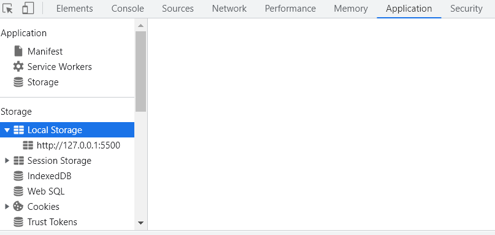

# Explain in My Language what I understand in the lecture

## 🔖 [Why JS]
- history
    - 1995.12 -> JS 10일만에 완성
    - Netscape -> 그 전 브라우저 (Only html and css) 

- https://threejs.org/
    - 자바스크립트 코드에 3D 적으로 도움을 주는 사이트

- React Native 
    - JS로 안드로이드, ios 앱을 앱을 만들 수 있는 프레임워크
    - (추가 설명 필요)

- electron
    - JS로 데스크톱 앱을 만들 수 있는 프레임워크
    - VScode, FaceBook Messenger, twitch, slack, figma 등이 electron으로 만들어졌다.

- `socket.io`
    - JS로 실시간 무언가를 만들고 싶을 때!

- `ml5.js`
    - JS 머신러닝

---

## 🔖 [Variables]
  - 파이썬은 변수 이름 붙이는 convention이 스네이크 케이스
  - JS는 카멜케이스
  
---

## 🔖 [Searching For Elements]
-  `getElementById` `getElementByClass` `getElementByTag` 
        -> 해당 조건에 맞는 요소들을 배열로 반환
    
- `querySelector` 
        -> css 형식으로 검색 가능 & 첫번째 것만 반환
    
- `querySelectorAll`
        -> css 형식으로 검색해서 조건에 맞는 모든 것을 NodeList로 반환
    
### 💡 **결론**
    `querySelector` 또는 `querySeletorAll` 만 쓴다

--- 

## 🔖 [Events]
### ✔️  `document` 의 존재 이유
-> **HTML** 에서 JS파일을 load 했기 때문
<br><br>


### ✔️ `addEventListener` 에 쓸 수 있는 event
-> `console.dir` 에서 앞에 `on` 이 붙은 프로퍼티가 이벤트요소
-> `addEventListener` 에 쓸때는 `on`을 빼고 쓰면 된다.

### ✔️ `document` 로 접근할 수 있는 요소
- `doucument.head`
- `document.body`
- `document.title`
❗ `document.meta` 는 접근불가.. ?
<br><br>
---
<br>

## 🔖 [CSS in Javascript part Two]
### ✔️ JS에서 CSS요소를 건드리는 일은? 
- [방법1] 원하는 CSS가 있는 클래스를 전달하기!
<br><br>
---
<br>
  
## 🔖 #4.0 [Input Values]
### ✔️ querySelector를 통한 검색
- document 또는 하나의 element를 통해서 검색 가능
```javascript
const loginForm = document.querySelector("#login-form");
const loginInput = loginForm.querySeletor("input");
```

### ✔️ [HTML] input 이 할 수 있는 일
- HTML의 `<input>`에서 할 수 있는 일은 굉장히 많다.
  - `required` `maxlength` 등등
  <br>=> 정리가 필요하다!!

### ✔️ [HTML] form
- `<form>` 안에 있는 `<input>` 태그 여야 유효성 검사를 할 수있다.
- `<input>` 안에 있는 `<button>`이나 `<input>` type이 `submit` 인 버튼을 누르면 작성한 `form` 이 submit된다.
<br><br>
---
<br>

## 🔖 #4.2 [Events]
### ✔️ `addEventListener`
- event가 발생할 때 등록된 handler 함수를 호출하는데 **파라미터로 정보를 전달한 상태**로 호출한다!
  - 그 정보는 일어난 Event에 대한 중요한 정보들을 담고 있다. 

### ✔️ `EventInstance.preventDefault()`
- 이벤트가 일어났을 때, Default로 실행되는 동작을 막아준다.

## 🔖 #4.5 [Saving Username]
### ✔️ `localStorage`
- 나중에 가져다 쓸 수 있도록 브라우저에 저장할 수 있게 해준다.
- 경로 application -> Local Storage
    
---
## 🔖 #6.0 [Background]
### ✔️ `createElement()`
- html 요소를 만들 수 있는 함수
---
## 🔖 #8.0 [Geolocation]
### ✔️ `getCurrentPosition()`
- success 콜백 함수 : GeolocationPosition 객체를 파라미터로 받음
- error 콜백 함수 : GeolocationPositionError 객체를 파라미터로 받음
- 브라우저 설정 중 위치 설정을 막았다면 error 함수 실행 (사용자가 차단 버튼 눌러도 error 함수 실행)
    -> 한번 차단했다면 그 정보가 저장되어서 크롬설정에서 바꾸지 않는 한 다시 허용할꺼냐고 물어보지 않음
---
## 🔖 #8.1 [Weather API]
### ✔️ API를 활용해 날씨 정보를 받아와서 화면에 표시
- API를 받아오는 과정에서 `fetch()` 이용